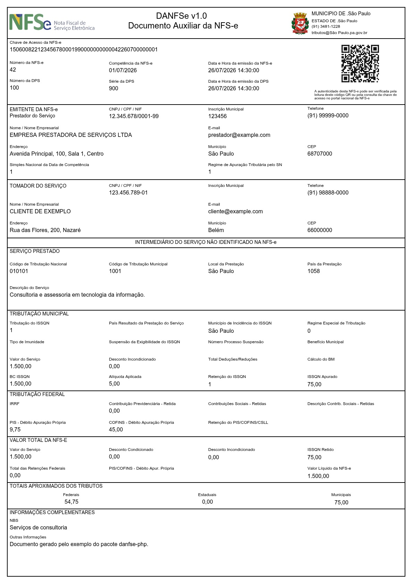

# DANFSe PHP

[](https://packagist.org/packages/nfse-nacional/danfse-php)
[](https://github.com/nfse-nacional/danfse-php/actions?query=workflow%3Arun-tests+branch%3Amain)
[](https://github.com/nfse-nacional/danfse-php/actions?query=workflow%3A%22Fix+PHP+code+style+issues%22+branch%3Amain)
[](https://packagist.org/packages/nfse-nacional/danfse-php)

Gere o PDF do Documento Auxiliar da Nota Fiscal de Serviço eletrônica (DANFSe) a partir dos dados da NFS-e Nacional. O pacote inclui o template JRXML, o mapeamento dos dados e os recursos visuais necessários para produzir o documento.

## Requisitos

- PHP 8.4 ou superior
- Extensões exigidas pelo Composer

## Instalação

```bash
composer require nfse-nacional/danfse-php
```

## Uso

O método `render()` recebe um array ou objeto com os dados da NFS-e e retorna o conteúdo binário do PDF:

```php
<?php

use Danfse\Danfse\Danfse;

require 'vendor/autoload.php';

$nfse = [
    'infNfse' => [
        'id' => 'NFS150600822123456780001990000000000042260700000001',
        'numeroNfse' => '42',
        'localEmissao' => 'São Paulo',
        'emitente' => [
            'endereco' => ['uf' => 'SP'],
        ],
        'dps' => [
            'infDps' => [
                'codigoLocalEmissao' => '3550308',
                'dataCompetencia' => '2026-07-01',
                'dataEmissao' => '2026-07-26T14:30:00-03:00',
            ],
        ],
    ],
];

$pdf = (new Danfse)->render($nfse);

file_put_contents('danfse.pdf', $pdf);
```



Para um payload mais completo, consulte o [exemplo de geração de PDF](examples/generate-pdf.php). As instruções para executá-lo estão na [documentação dos exemplos](examples/README.md).

## Integração com `nfse-nacional/nfse-php`

Este pacote aceita diretamente o `NfseData` retornado pelo
[`nfse-nacional/nfse-php`](https://github.com/nfse-nacional/nfse-php).
Instale os dois pacotes:

```bash
composer require nfse-nacional/nfse-php nfse-nacional/danfse-php
```

Depois de consultar a NFS-e pelo SDK, passe o DTO retornado diretamente para
`Danfse::render()`. A chave, o link de consulta pública, o município e os demais
dados do documento são resolvidos pelo próprio payload:

```php
<?php

use Danfse\Danfse\Danfse;
use Nfse\Enums\TipoAmbiente;
use Nfse\Http\NfseContext;
use Nfse\Nfse;

require 'vendor/autoload.php';

$context = new NfseContext(
    ambiente: TipoAmbiente::Producao,
    certificatePath: '/caminho/certificado.pfx',
    certificatePassword: 'senha-do-certificado',
);

$sdk = new Nfse($context);
$chave = '150600822123456780001990000000000042260700000001';
$nfseData = $sdk->contribuinte()->consultar($chave);

if ($nfseData === null) {
    throw new RuntimeException('NFS-e não encontrada.');
}

$pdf = (new Danfse)->render($nfseData);

file_put_contents('danfse.pdf', $pdf);
```

Para exibir uma imagem institucional no cabeçalho, informe uma URL no
parâmetro opcional `imgPrefeitura`:

```php
$pdf = (new Danfse)->render($nfseData, [
    'imgPrefeitura' => 'https://example.com/images/brasao.png',
]);
```

Se a fonte usada na renderização for um array ou objeto próprio, o mapper
também reconhece `imgPrefeitura` diretamente:

```php
$nfse = [
    'imgPrefeitura' => 'https://example.com/images/brasao.png',
    'infNfse' => $dadosDaNfse,
];

$pdf = (new Danfse)->render($nfse);
```

Ao usar o `NfseData` retornado pelo `nfse-nacional/nfse-php`, prefira a primeira
forma, usando o segundo argumento de `render()`, pois a imagem institucional
não faz parte do payload fiscal.

Quando `imgPrefeitura` não é informado ou recebe uma string vazia, nenhuma
imagem é exibida. Use somente URLs confiáveis e acessíveis pelo servidor que
gera o PDF. Um caminho de arquivo local também é aceito.

O mesmo fluxo pode ser usado com o `NfseData` devolvido por
`$sdk->contribuinte()->emitir($dps)`.

## Fontes

O template padrão utiliza a família `Arial` nos estilos regular, negrito,
itálico e negrito-itálico. Não é necessário instalar a fonte manualmente para
usar o template incluído no pacote.

Ao criar a instância de `Danfse`, o pacote localiza automaticamente o diretório
de fontes distribuído pelo `quilhasoft/jasperphp` e o informa ao
`JxrmlTemplateEngine`. As definições utilizadas pelo TCPDF são:

| Estilo do JRXML | Definição TCPDF |
| --- | --- |
| `Arial` regular | `arial.php` e `arial.z` |
| `Arial` negrito | `arialb.php` e `arialb.z` |
| `Arial` itálico | `ariali.php` e `ariali.z` |
| `Arial` negrito-itálico | `arialbi.php` e `arialbi.z` |

Esses arquivos são instalados transitivamente em:

```text
vendor/quilhasoft/jasperphp/src/fonts
```

Uma fonte `.ttf` isolada não é suficiente para o TCPDF. Ao usar outra família
em um template personalizado, o diretório precisa conter as definições TCPDF
geradas para todos os estilos utilizados, normalmente arquivos `.php`, `.z` e
`.ctg.z`.

Para informar um diretório próprio de fontes, injete uma engine configurada:

```php
use A2Insights\JxrmlTemplateEngine\JxrmlRenderer;
use A2Insights\JxrmlTemplateEngine\JxrmlTemplateEngine;
use Danfse\Danfse\Danfse;

$renderer = new JxrmlRenderer(
    fontDirectory: __DIR__.'/fonts',
);

$engine = new JxrmlTemplateEngine($renderer);
$danfse = new Danfse(engine: $engine);

$pdf = $danfse->render($nfse);
```

O valor de `fontName` no JRXML deve corresponder ao nome registrado na
definição TCPDF. Em sistemas Linux, mantenha também o nome dos arquivos em
minúsculas para evitar diferenças entre ambientes.

## Estrutura dos dados

O argumento principal de `render()` é o próprio payload nacional, com
`infNfse` na raiz, ou diretamente o `NfseData` retornado pelo
`nfse-nacional/nfse-php`. Não é necessário criar um nível adicional como
`payload_nfse` nem duplicar dados do XML em campos auxiliares.

O mapeador obtém do payload, entre outros dados:

| Origem no payload | Uso no DANFSe |
| --- | --- |
| `infNfse.id` | Chave de acesso e URL da consulta pública |
| `infNfse.numeroNfse` | Número da NFS-e |
| `infNfse.localEmissao` | Município de emissão e município do prestador |
| `infNfse.localPrestacao` | Local da prestação |
| `infNfse.nomeLocalIncidencia` | Local de incidência do ISSQN |
| `infNfse.emitente.endereco.uf` | UF do município de emissão |
| `infNfse.dps.infDps.codigoLocalEmissao` | Código IBGE do município de emissão |
| `infNfse.dps.infDps` | DPS, prestador, tomador, serviço e valores |

A URL do QR Code é derivada automaticamente da chave no formato oficial da
Consulta Pública. Somente informações que não pertencem ao XML nacional, como
a URL opcional `imgPrefeitura`, devem ser passadas no segundo argumento de
`render()`.

Arrays, objetos, propriedades públicas e objetos que exponham os dados por
métodos são aceitos pelo mapeador. O envelope antigo com `payload_nfse`
continua aceito apenas para compatibilidade.

## Personalização

É possível fornecer outro template JRXML no construtor ou apenas para uma renderização:

```php
$danfse = new Danfse(template: '/caminho/template.jrxml');

$pdf = $danfse->render($nfse);

// Ou somente nesta chamada:
$pdf = $danfse->render($nfse, template: '/caminho/outro-template.jrxml');
```

Para alterar o mapeamento, estenda `NfseTemplateMapper` e sobrescreva `mapParameter()`:

```php
use Danfse\Danfse\Mappers\NfseTemplateMapper;

$mapper = new class extends NfseTemplateMapper
{
    protected function mapParameter(string $name, mixed $value, mixed $source, array $config): mixed
    {
        return $name === 'nNFSe' ? 'NFSe '.$value : $value;
    }
};

$pdf = (new Danfse)->render($nfse, mapper: $mapper);
```

## Desenvolvimento

```bash
composer test
composer analyse
composer format
```

## Changelog

Consulte o [CHANGELOG](CHANGELOG.md) para acompanhar as alterações.

## Créditos

- [a21ns1g4ts](https://github.com/a21ns1g4ts)
- [Todos os contribuidores](../../contributors)

## Licença

Distribuído sob a licença MIT. Consulte o arquivo [LICENSE](LICENSE.md).
